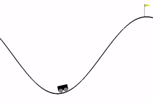

# Deep Reinforcement Learning on MountainCar-v0 

Project work for "Autonomous and Adaptive Systems" (held by Prof. Mirco Musolesi) University of Bologna.

The goal of this project is to compare, from a performance point of view, three different implementations of one of the most common reinforcement learning algorithms: Deep Q-Learning. In particular, DQN, DQN with Fixed Q-targets, and Double-DQN were chosen. The comparison was made using the same hyperparameters. The results showed that although all three implementations solved the environment under consideration, the two optimizations of the base algorithm led to better results.

The agents have been compared on the MountainCar-v0 OpenAI-Gym environment:


For a detailed explaination, consult [this mini paper](/Paper_MountainCar_DQN_FQTDQN_DDQN.pdf).
## Dependencies
- PyTorch
- OpenAI gym
- NumPy
- Matplotlib


## Installation
Clone this repository:
```
git clone https://github.com/aleefrank/DQL-MountainCar.git
```
Move to the project's root folder DQL-MountainCar and run:
```
pip3 install -r requirements.txt
```
## Running the program
By running
```
python main.py
``` 
a basic user interface will be launched, showing all the available options.

In particular, the user will be allowed to:
1. Train the model of a specific Agent.
2. Test the model of a specific Agent, starting from the best parameters found during training.
3. Plot the training results of a specific Agent, starting from `.npy` arrays saved in training phase.
4. Terminate the program
